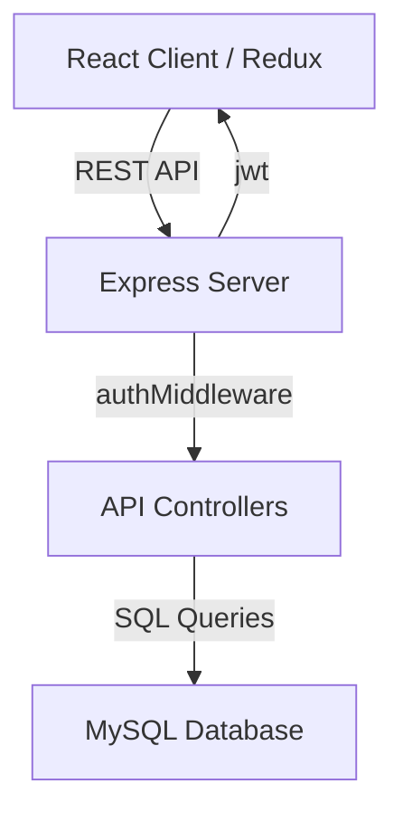

# MERN Network (Social Network for Developers)

A full-stack social networking platform specifically designed for developers to connect, share experiences, and collaborate on projects. Built using the classic MERN stack (but adapted with MySQL), this application provides a robust environment for building professional profiles and networking within the tech community.

## 🚀 Key Features

- **Developer Profiles:** Comprehensive profiles featuring technical skills, experience, and educational background.
- **Real-time Networking:** Connect with other developers and view their professional portfolios.
- **Experience Tracking:** Dedicated sections for managing and showcasing professional work history.
- **Secure Authentication:** Integrated JWT-based authentication for secure user registration and login.
- **RESTful API:** Clean and modular backend API designed with Express and Node.js.

## 🏗️ Technical Architecture



**System Data Flow:**
```
[ User Action ] ──> [ React Component ] ──> [ Redux Action/Thunk ]
                                                │
                                        [ Axios / API Call ]
                                                │
[ JSON Response ] <── [ Express Route ] <── [ Controller (SQL) ]
```

## 🛠️ Tech Stack

- **Frontend:** React.js, Redux (State Management), React Router, Axios
- **Backend:** Node.js, Express.js
- **Database:** MySQL (using `mysql2`)
- **Authentication:** JSON Web Tokens (JWT), BcryptJS
- **Middleware:** Express-validator for input validation, custom auth middleware

## 🏃 How to Run

### Prerequisites
- Node.js 14+
- MySQL Server
- npm or yarn

### Installation
1. Clone the repository:
   ```bash
   git clone https://github.com/pavandongare/mern.git
   cd mern
   ```
2. Install server-side dependencies:
   ```bash
   npm install
   ```
3. Install client-side dependencies:
   ```bash
   cd client
   npm install
   cd ..
   ```

### Database Setup
1. Create a MySQL database (e.g., `devnetwork`).
2. Import the schema:
   - Run the queries in `database tables.sql` to set up the necessary tables.
3. Configure connection:
   - Update `config/default.json` with your MySQL credentials.

### Development
```bash
# Run both client and server concurrently
npm run dev
```

### Production Build
```bash
# Build the React application
cd client
npm run build
```

---
Built with ❤️ by [Pavan Dongare](https://github.com/pavandongare)
